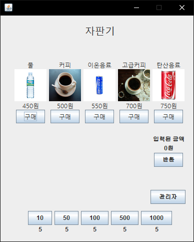
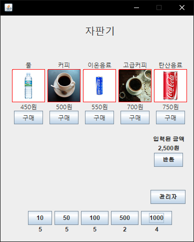
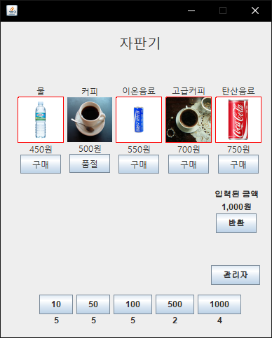
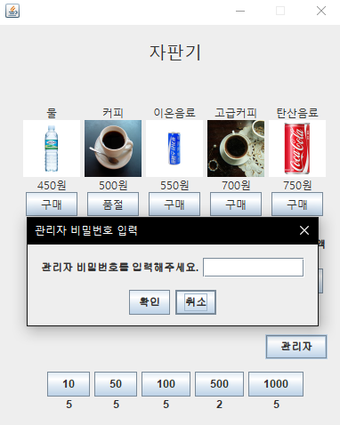
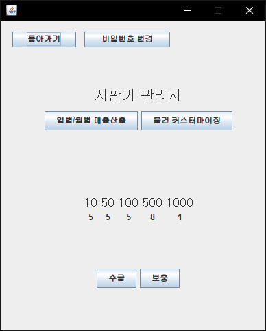
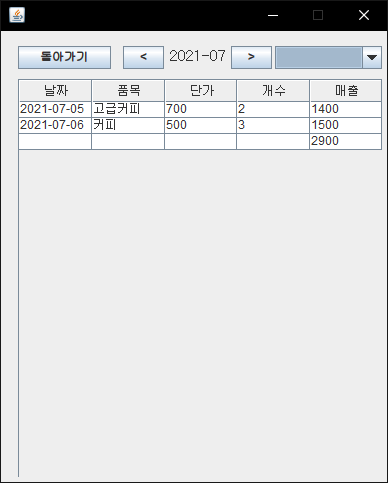
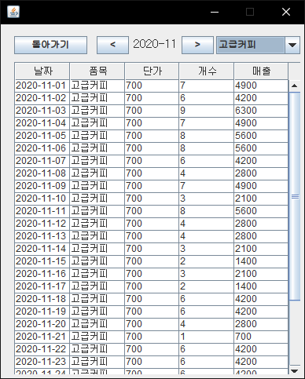
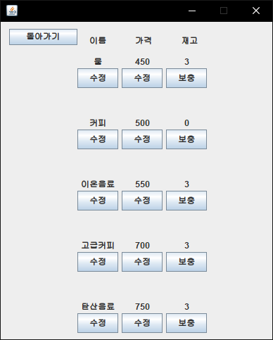
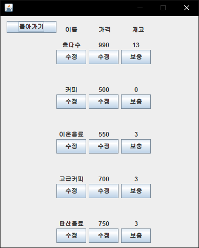

# Vending Machine
2학년 2학기 자바 텀 프로젝트로 약 1달간 제작한 자판기 프로그램입니다.

요구된 기능을 간단히 정리하면 다음과 같습니다.

1. 음료 재고
2. 화폐(소지금, 잔돈)
3. 관리자 메뉴 비밀번호(변경 가능)
4. 일별/월별 매출 산출(파일 입출력)
5. 음료 재고 보충

 

# 구현

구현에는 Java, Java Swing(WindowBuilder 플러그인) 을 사용했습니다.

매출 계산 시 이진 탐색 트리를 사용했습니다.

스택을 이용해 트리를 중위 순회하여 오름차순으로 정렬된 매출이 출력되도록 하였습니다.

관리자 비밀번호는 정해진 Key 에 의해 XOR 연산된 값이 pw.dat 파일에 저장됩니다.  
따라서 pw.dat 파일만으로는 비밀번호를 알 수 없습니다.

 

# 결과

## 음료 재고

 

## 화폐 입력
입력된 금액에 따라 구매 가능한 아이템이 강조됩니다.  

 

## 음료 구매
음료의 기본 재고는 3개, 품절 시 구매가 비활성화 되고 품절을 표시합니다.  

 

## 잔돈 반환
입력된 금액에서 반환 버튼을 누르면 금액에 맞는 적당한 화폐를 사용자에게 지급합니다.  

 

## 관리자 메뉴
관리자 버튼을 누르면 비밀번호 입력 창이 표시됩니다.  

 

비밀번호 변경, 매출 산출, 물건 커스터마이팅(이름 변경, 가격 수정, 재고 보충) 등이 가능합니다.  

 

## 일별/월별 매출 산출
월별 매출 정보가 오름차순으로 출력됩니다.  

 

음료별 매출 정보도 확인할 수 있습니다.  

 

## 음료 커스터마이징
음료의 이름, 가격, 재고를 수정할 수 있습니다.  

사용자 메뉴에 수정 사항이 바로 반영됩니다.

 